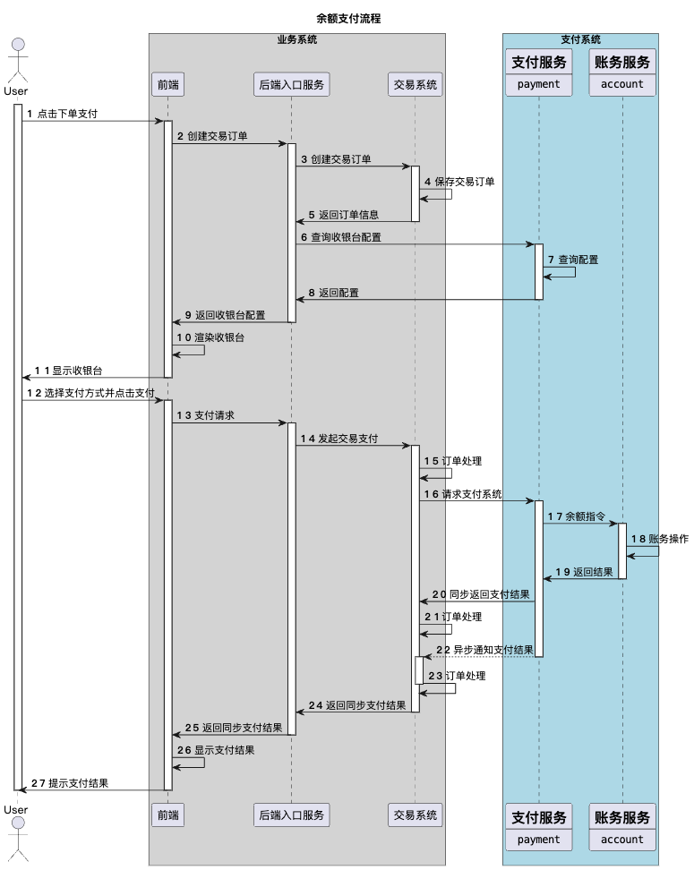
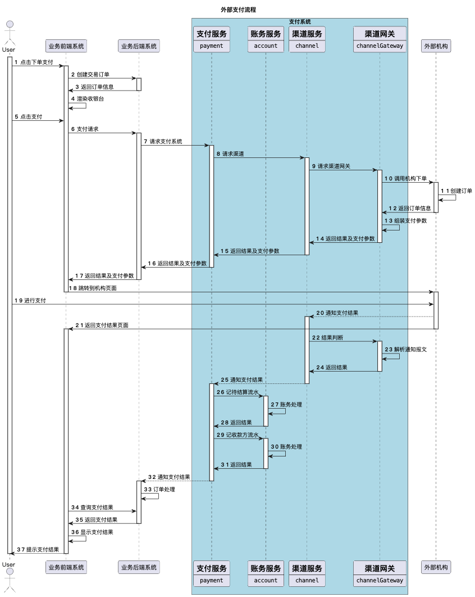
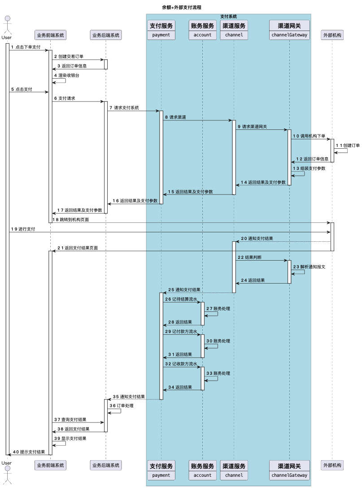

## 项目介绍

`anypluspay`是一套基于领域驱动设计（DDD）理念，采用微服务架构构建的高性能、高可用、易扩展的支付系统解决方案。
项目包含支付服务、账务服务、渠道网关等核心服务，提供从支付接入、交易处理、资金清算到对账管理的完整支付功能，可快速适配各类电商平台、产业互联网平台等场景的支付需求。

### 项目特色

领域驱动设计（DDD）： 采用DDD进行领域建模，将支付业务划分为清晰的限界上下文，确保系统架构清晰、代码可维护性强，并能快速响应业务变化。

微服务架构： 系统采用Spring Cloud等主流微服务框架构建，各子系统独立部署、松耦合，可根据业务需求灵活扩展，满足高并发、高可用的支付场景。

高性能、高可用： 采用分布式缓存、消息队列、数据库分库分表等技术，保障系统在高并发场景下的稳定性和性能。

灵活可扩展： 系统提供丰富的API接口和插件机制，方便与各类电商平台、第三方支付渠道进行对接，并可根据业务需求灵活扩展功能。

### 核心服务

支付服务： 负责支付交易的接入、路由、风控、清算等核心流程，支持多种支付方式（如银行卡、第三方支付等）。

账务服务： 负责账户管理、资金流水记录、对账等功能，保障资金安全准确。

渠道服务及渠道网关： 负责与第三方支付渠道进行对接，实现支付指令的发送和接收。

运营平台： 提供交易查询、数据分析、报表统计等功能，方便运营人员进行系统管理和业务分析。

### 适用场景

电商平台：为电商平台提供安全、稳定、便捷的支付服务，提升用户支付体验。

产业互联网平台：为产业互联网平台提供定制化的支付解决方案，满足不同行业的支付需求。

其他场景：适用于各类需要在线支付的场景，例如在线教育、旅游出行、生活服务等。

### 项目愿景
致力于打造一套开源、易用、功能强大的支付系统解决方案，帮助开发者快速构建安全可靠的支付系统，推动支付行业的技术发展。

## 核心模型
### 单据模型


## 核心流程
### 余额支付

### 外部支付

### 余额+外部支付

## 系统介绍

### 系统整体目录结构

``` java
anypluspay
    ├── app -- 应用服务目录
         ├── admin -- 运营平台
         ├── payment -- 支付服务
         ├── account -- 账务服务
         ├── channel -- 渠道服务
         ├── channel-gateway -- 渠道网关目录
                ├── alipay-gateway -- 支付宝网关
                ├── wxpay-gateway -- 微信网关
                └── test-bank-gateway -- 测试银行网关
         ├── test-bank -- 测试银行服务，用于模拟支付渠道
         └── test-trade -- 测试交易服务，用于模拟支付交易侧
    
    ├── framework -- 框架目录
            ├── commons -- 公共
                    └── commons-lang -- 通用工具和类型
            ├── commponent -- 组件
                    ├── commponent-api -- 组件API定义
                    ├── commponent-core -- 组件核心实现
                    ├── commponent-sequnce -- 序列号
                    └── commponent-generator -- 代码生成器
            ├── dependencies -- 依赖定义pom
            ├── dependencies-third -- 第三方依赖定义pom
            └── parent -- 应用父POM
    └── docs -- 文档目录
```
### 服务列表

为了便于本地测试端口是不一样的，如果要在k8s部署，建议都用`80`，端口配置在Nacos中。

| 服务                 | 说明 | 开放方式       | 端口 
|--------------------|-------|------------|------ 
| admin              | 运营后台服务| Spring Mvc | 8080 
| payment            | 支付服务   | Feign  | 8081       
| account            | 账务服务  | Feign | 8082       
| channel            | 渠道服务  | Feign | 8083       
| test-bank-gateway | 测试银行网关| Feign | 8090       
| alipay-gateway    | 支付宝网关  | Feign| 8091       
| wxpay-gateway     | 微信网关   | Feign| 8092       
| test-bank         | 测试银行   | Spring Mvc| 8070       
| test-trade        | 测试交易   | Feign| 8071       

### 应用目录结构

#### 后端服务

根据DDD将应用服务进行层次划分

以`channel`为例，目录结构：

``` java
channel -- 应用名称
    ├── app -- 应用代码目录
         ├── bootstrap -- 启动层，测试用例也在此
         ├── web -- web层，如果要提供http接口，则放在此
         ├── infra -- 基础设施层
                ├── infa-dal -- 数据访问层，涉及admin访问的，可单独提出来以便复用
                └── infa-integration -- 基础设施集成层
         ├── application -- 应用层
         ├── facade -- 对外接口层
         ├── domain -- 领域层
         └── types -- 类型层，公共类型、值对象
    ├── conf -- 配置目录
    └── gen -- 代码生成器目录
         └── dalgen -- dal生成器，自动生成数据库访问代码
```

依赖关系：


#### 微服务入口应用

微服务入口应用没有太多逻辑，重在集成，不必严格按照`DDD`来

如`admin`

``` java
admin -- 应用名称
    └── app -- 应用代码目录
         ├── admin-basis -- admin服务公共层，如鉴权、权限等
         ├── admin-bootstrap -- 启动层
         └── admin-channel -- 渠道相关管理接口
```

### 技术栈

| 软件名称                                                                    | 描述          | 版本         
|-------------------------------------------------------------------------|-------------|------------
| JDK                                                                     | Java环境      | 17         
| [Spring Boot](https://github.com/spring-projects/spring-boot)           | 开发框架        | 3.4.1      
| [Spring Cloud](https://spring.io/projects/spring-cloud)                 | 微服务         | 2024.0.0   
| MySQL                                                                   | 数据库         | 8+         
| Redis                                                                   | 缓存          | ?          
| [spring-cloud-alibaba](https://github.com/alibaba/spring-cloud-alibaba) | Nacos依赖     | 2023.0.3.2 
| [Nacos](https://github.com/alibaba/nacos)                               | 注册中心、配置中心   | 2.4.1      
| [MyBatis-Plus](https://mp.baomidou.com/)                                | MyBatis增强工具 | 3.5.4.1    
| [MapStruct](https://mapstruct.org/)                                     | 对象转换        | 1.6.3      
| [Hutool](https://www.hutool.cn/)                                        | Java工具类库    | 5.8.24

## 后台管理功能

### 渠道管理


## 测试
### 单元测试
`payment`、`account`、`channel`三个服务下都有单元测试，通过`JUnit`和`Mockito`进行测试，位于`app/bootstrap/test`下，依赖数据库和Nacos配置
### 启动测试
#### 启动服务
1、必需要启动的服务有`admin`、`payment`、`account`、`channel`，`test-trade`
2、测试渠道对应的渠道网关，如果要使用测试渠道，`test-bank`也需要启动。
#### 开始测试
1、输入`admin`的地址，如`http://localhost:8080/` 。
2、左侧展开`支付测试`菜单，点击相应的二级菜单进行测试。
3、对于产生的测试交易，可在菜单`支付测试`下`交易查询`进行查询。

## 附录

### 关于支付

1、可关注微信公众号`凤凰牌老熊`,`隐墨星辰`,`刚哥白话`,`陈天宇宙`

### 关于`DDD`

1、[殷浩详解DDD系列](https://developer.aliyun.com/article/715802)

2、[COLA框架](https://github.com/alibaba/COLA)

3、[COLA 4.0：应用架构的最佳实践](https://blog.csdn.net/significantfrank/article/details/110934799)