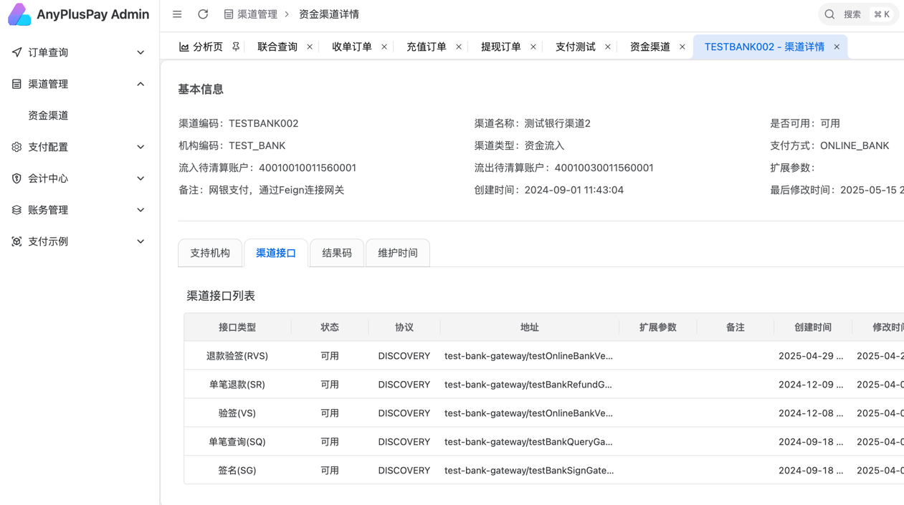

## 项目介绍

`anypluspay`旨在解决互联网企业支付问题，目标提供各行业+支付的完整解决方案。

## 系统介绍

### 系统整体目录结构

``` java
anypluspay
    ├── app -- 应用服务目录
         ├── admin -- 后台管理服务
         ├── account -- 账务服务
         ├── channel -- 渠道服务
         ├── channel-gateway -- 渠道网关目录
                ├── alipay-gateway -- 支付宝网关
                ├── wxpay-gateway -- 微信网关
                └── testbank-gateway -- 测试银行网关
         └── testbank -- 测试银行服务，用于模拟支付渠道
    
    ├── framework -- 框架目录
            ├── commons -- 公共
                    └── commons-lang -- 通用工具和类型
            ├── commponent -- 组件
                    ├── commponent-api -- 组件API定义
                    ├── commponent-core -- 组件核心实现
                    ├── commponent-sequnce -- 序列号
                    └── commponent-generator -- 代码生成器
            ├── dependencies -- 依赖定义pom
            ├── dependencies-third -- 第三方依赖定义pom
            └── parent -- 应用父POM
    └── docs -- 文档目录
```

### 应用目录结构

#### 后端服务

根据DDD将应用服务进行层次划分

以`channel`为例，目录结构：

``` java
channel -- 应用名称
    ├── app -- 应用代码目录
         ├── bootstrap -- 启动层，测试用例也在此
         ├── web -- web层，如果要提供http接口，则放在此
         ├── infra -- 基础设施层
                ├── infa-dal -- 数据访问层，涉及admin访问的，可单独提出来以便复用
                └── infa-integration -- 基础设施集成层
         ├── application -- 应用层
         ├── facade -- 对外接口层
         ├── domain -- 领域层
         └── types -- 类型层，公共类型、值对象
    ├── conf -- 配置目录
    └── gen -- 代码生成器目录
         └── dalgen -- dal生成器，自动生成数据库访问代码
```

依赖关系：


#### 微服务入口应用

微服务入口应用没有太多逻辑，重在集成，不必严格安装`DDD`来

如`admin`

``` java
admin -- 应用名称
    └── app -- 应用代码目录
         ├── admin-basis -- admin服务公共层，如鉴权、权限等
         ├── admin-bootstrap -- 启动层
         └── admin-channel -- 渠道相关管理接口
```

如果后续涉及业务的管理，可以再增加`module`，如`admin-cashier`

### 技术栈

| 软件名称                                                                    | 描述          | 版本         
|-------------------------------------------------------------------------|-------------|------------
| JDK                                                                     | Java环境      | 17         
| [Spring Boot](https://github.com/spring-projects/spring-boot)           | 开发框架        | 3.4.1      
| [Spring Cloud](https://spring.io/projects/spring-cloud)                 | 微服务         | 2024.0.0   
| MySQL                                                                   | 数据库         | 8+         
| Redis                                                                   | 缓存          | ?          
| [spring-cloud-alibaba](https://github.com/alibaba/spring-cloud-alibaba) | Nacos依赖     | 2023.0.3.2 
| [Nacos](https://github.com/alibaba/nacos)                               | 注册中心、配置中心   | 2.4.1      
| [MyBatis-Plus](https://mp.baomidou.com/)                                | MyBatis增强工具 | 3.5.4.1    
| [MapStruct](https://mapstruct.org/)                                     | 对象转换        | 1.6.3      
| [Hutool](https://www.hutool.cn/)                                        | Java工具类库    | 5.8.24     

## 后台管理功能

### 渠道管理




## 附录

### 关于支付

1、可关注微信公众号`凤凰牌老熊`,`隐墨星辰`,`刚哥白话`,`陈天宇宙`

### 关于`DDD`

1、[殷浩详解DDD系列](https://developer.aliyun.com/article/715802)

2、[COLA框架](https://github.com/alibaba/COLA)

3、[COLA 4.0：应用架构的最佳实践](https://blog.csdn.net/significantfrank/article/details/110934799)